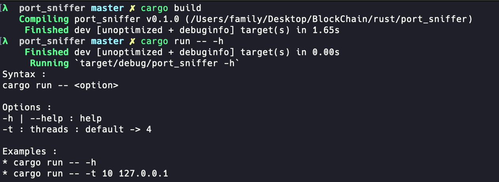
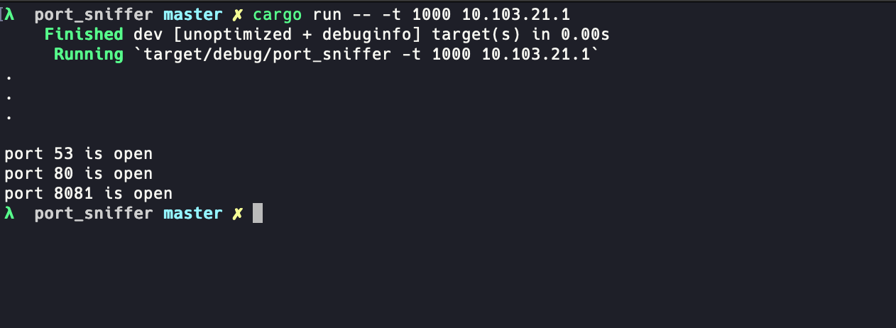

# PORT SNIFFER

Simple tool build in rust using standard libs to capture open ports in a device using the (network) IP address of that device.

## Project

```sh
cargo build
cargo run -- -h
```



```sh
cargo run -t 1000 <IP_ADDR>
```



## Reference Libraries

Thread Lib : <https://doc.rust-lang.org/std/thread/>

Sync Lib (Creating thread channels) : <https://doc.rust-lang.org/std/sync/index.html>

Net Lib : <https://doc.rust-lang.org/std/net/struct.TcpStream.html>

**Thread Lib :**

Library to create a `thread` in the memory.

```rs
thread::spawn(move || {
    // Code here
});
```

**Sync Lib :**

Library to create a thread channel with a transmittor and reciever and share the result with threads.

```rs
// tx: transmitter
// rx : reciever
let (tx, rx) = channel();
// dropping the transmittor
drop(tx);
```

**Net Lib :**

Library to interact with TCP interface and ports.

```rs
TcpStream::connect((addr, port)) {}
```
